# [📈 Live Status](https://neuvians.io): <!--live status--> **🟧 Partial outage**

This repository contains the open-source uptime monitor and status page for [Upptime](https://upptime.js.org), powered by [Upptime](https://github.com/upptime/upptime).

With [Upptime](https://upptime.js.org), you can get your own unlimited and free uptime monitor and status page, powered entirely by a GitHub repository. We use [Issues](https://github.com/upptime/upptime/issues) as incident reports, [Actions](https://github.com/maxneuvians/status-statut/actions) as uptime monitors, and [Pages](https://neuvians.io) for the status page.

<!--start: status pages-->
<!-- This summary is generated by Upptime (https://github.com/upptime/upptime) -->
<!-- Do not edit this manually, your changes will be overwritten -->
<!-- prettier-ignore -->
| URL | Status | History | Response Time | Uptime |
| --- | ------ | ------- | ------------- | ------ |
|  [Canada.ca](https://www.canada.ca/) | Up / Opérationnel | [canada-ca.yml](https://github.com/maxneuvians/status-statut/commits/HEAD/history/canada-ca.yml) | 

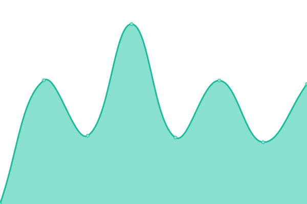 1995ms
     
 | 

<a href="https://maxneuvians.github.io/history/canada-ca">100.00%</a>
    

|  [Canada Industrial Relations Board](https://www.cirb-ccri.gc.ca/) | Up / Opérationnel | [canada-industrial-relations-board.yml](https://github.com/maxneuvians/status-statut/commits/HEAD/history/canada-industrial-relations-board.yml) | 

 486ms
     
 | 

<a href="https://maxneuvians.github.io/history/canada-industrial-relations-board">100.00%</a>
    

|  [Home / Social Security Tribunal of Canada](https://sst-tss.gc.ca/) | Down / En panne | [home-social-security-tribunal-of-canada.yml](https://github.com/maxneuvians/status-statut/commits/HEAD/history/home-social-security-tribunal-of-canada.yml) | 

 0ms
     
 | 

<a href="https://maxneuvians.github.io/history/home-social-security-tribunal-of-canada">0.00%</a>
    

|  [Department of Justice / Ministère de la Justice](https://justice.gc.ca/) | Up / Opérationnel | [department-of-justice-ministere-de-la-justice.yml](https://github.com/maxneuvians/status-statut/commits/HEAD/history/department-of-justice-ministere-de-la-justice.yml) | 

 228ms
     
 | 

<a href="https://maxneuvians.github.io/history/department-of-justice-ministere-de-la-justice">100.00%</a>
    

|  [Welcome to the Health Canada Web site / Bienvenue au site Web de Santé Canada](https://hc-sc.gc.ca/) | Up / Opérationnel | [welcome-to-the-health-canada-web-site-bienvenue-au-site-web-de-sante-canada.yml](https://github.com/maxneuvians/status-statut/commits/HEAD/history/welcome-to-the-health-canada-web-site-bienvenue-au-site-web-de-sante-canada.yml) | 

 206ms
     
 | 

<a href="https://maxneuvians.github.io/history/welcome-to-the-health-canada-web-site-bienvenue-au-site-web-de-sante-canada">100.00%</a>
    

|  [Immigration, Refugees and Citizenship Canada / Immigration, Réfugiés et Citoyenneté Canada](https://ircc.canada.ca/) | Up / Opérationnel | [immigration-refugees-and-citizenship-canada-immigration-refugies-et-citoyennete-canada.yml](https://github.com/maxneuvians/status-statut/commits/HEAD/history/immigration-refugees-and-citizenship-canada-immigration-refugies-et-citoyennete-canada.yml) | 

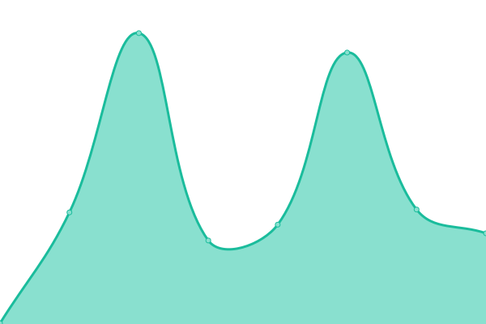 209ms
     
 | 

<a href="https://maxneuvians.github.io/history/immigration-refugees-and-citizenship-canada-immigration-refugies-et-citoyennete-canada">100.00%</a>
    

|  [Impact Assessment Agency of Canada / Agence d'évaluation d'impact du Canada](https://iaac-aeic.gc.ca) | Up / Opérationnel | [impact-assessment-agency-of-canada-agence-d-evaluation-d-impact-du-canada.yml](https://github.com/maxneuvians/status-statut/commits/HEAD/history/impact-assessment-agency-of-canada-agence-d-evaluation-d-impact-du-canada.yml) | 

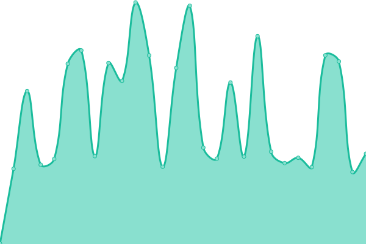 230ms
     
 | 

<a href="https://maxneuvians.github.io/history/impact-assessment-agency-of-canada-agence-d-evaluation-d-impact-du-canada">100.00%</a>
    

|  [Services aux Autochtones Canada / Indigenous Services Canada - Canada.ca](https://sac-isc.gc.ca/) | Up / Opérationnel | [services-aux-autochtones-canada-indigenous-services-canada-canada-ca.yml](https://github.com/maxneuvians/status-statut/commits/HEAD/history/services-aux-autochtones-canada-indigenous-services-canada-canada-ca.yml) | 

 375ms
     
 | 

<a href="https://maxneuvians.github.io/history/services-aux-autochtones-canada-indigenous-services-canada-canada-ca">100.00%</a>
    

|  [Innovation, Science and Economic Development Canada Main Site / Site principal d'Innovation, Sciences et Développement économique Canada](https://ised-isde.canada.ca/) | Up / Opérationnel | [innovation-science-and-economic-development-canada-main-site-site-principal-d-innovation-sciences-et-developpement-economique-canada.yml](https://github.com/maxneuvians/status-statut/commits/HEAD/history/innovation-science-and-economic-development-canada-main-site-site-principal-d-innovation-sciences-et-developpement-economique-canada.yml) | 

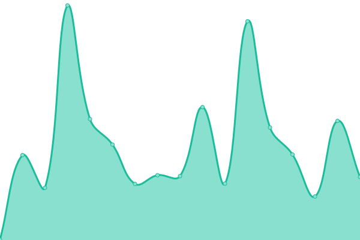 324ms
     
 | 

<a href="https://maxneuvians.github.io/history/innovation-science-and-economic-development-canada-main-site-site-principal-d-innovation-sciences-et-developpement-economique-canada">100.00%</a>
    

|  [Patented Medicine Prices Review Board / Conseil d'examen du prix des médicaments brevetés](http://www.pmprb-cepmb.gc.ca/) | Up / Opérationnel | [patented-medicine-prices-review-board-conseil-d-examen-du-prix-des-medicaments-brevetes.yml](https://github.com/maxneuvians/status-statut/commits/HEAD/history/patented-medicine-prices-review-board-conseil-d-examen-du-prix-des-medicaments-brevetes.yml) | 

 2795ms
     
 | 

<a href="https://maxneuvians.github.io/history/patented-medicine-prices-review-board-conseil-d-examen-du-prix-des-medicaments-brevetes">100.00%</a>
    

|  [Canadian Anti-Fraud Centre / Centre antifraude du Canada](https://antifraudcentre-centreantifraude.ca/) | Up / Opérationnel | [canadian-anti-fraud-centre-centre-antifraude-du-canada.yml](https://github.com/maxneuvians/status-statut/commits/HEAD/history/canadian-anti-fraud-centre-centre-antifraude-du-canada.yml) | 

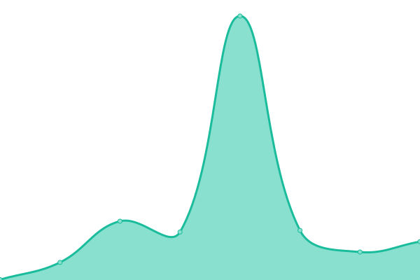 271ms
     
 | 

<a href="https://maxneuvians.github.io/history/canadian-anti-fraud-centre-centre-antifraude-du-canada">100.00%</a>
    

|  [Canadian Center for Cyber Security / Centre canadien pour la cybersécurité](https://www.cyber.gc.ca/) | Up / Opérationnel | [canadian-center-for-cyber-security-centre-canadien-pour-la-cybersecurite.yml](https://github.com/maxneuvians/status-statut/commits/HEAD/history/canadian-center-for-cyber-security-centre-canadien-pour-la-cybersecurite.yml) | 

 219ms
     
 | 

<a href="https://maxneuvians.github.io/history/canadian-center-for-cyber-security-centre-canadien-pour-la-cybersecurite">100.00%</a>
    

|  [Transport Canada / Transports Canada](https://tc.canada.ca/) | Up / Opérationnel | [transport-canada-transports-canada.yml](https://github.com/maxneuvians/status-statut/commits/HEAD/history/transport-canada-transports-canada.yml) | 

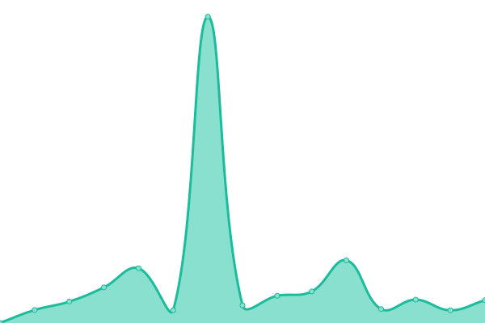 272ms
     
 | 

<a href="https://maxneuvians.github.io/history/transport-canada-transports-canada">99.84%</a>
    

|  [Page d'accueil de Condition féminine Canada / Status of Women Canada Web Welcome Page](https://cfc-swc.gc.ca/) | Up / Opérationnel | [page-d-accueil-de-condition-feminine-canada-status-of-women-canada-web-welcome-page.yml](https://github.com/maxneuvians/status-statut/commits/HEAD/history/page-d-accueil-de-condition-feminine-canada-status-of-women-canada-web-welcome-page.yml) | 

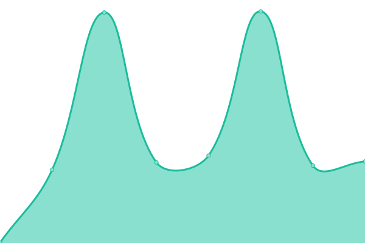 137ms
     
 | 

<a href="https://maxneuvians.github.io/history/page-d-accueil-de-condition-feminine-canada-status-of-women-canada-web-welcome-page">100.00%</a>
    

|  [Canadian Institutes of Health Research / Instituts de recherche en santé du Canada](https://cihr-irsc.gc.ca/) | Up / Opérationnel | [canadian-institutes-of-health-research-instituts-de-recherche-en-sante-du-canada.yml](https://github.com/maxneuvians/status-statut/commits/HEAD/history/canadian-institutes-of-health-research-instituts-de-recherche-en-sante-du-canada.yml) | 

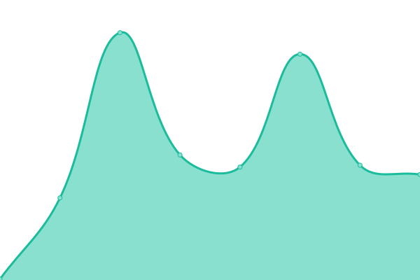 167ms
     
 | 

<a href="https://maxneuvians.github.io/history/canadian-institutes-of-health-research-instituts-de-recherche-en-sante-du-canada">100.00%</a>
    

|  [Conseil de la radiodiffusion et des télécommunications canadiennes / Canadian Radio-television and Telecommunications Commission / CRTC](https://crtc.gc.ca/) | Up / Opérationnel | [conseil-de-la-radiodiffusion-et-des-telecommunications-canadiennes-canadian-radio-television-and-telecommunications-commission-crtc.yml](https://github.com/maxneuvians/status-statut/commits/HEAD/history/conseil-de-la-radiodiffusion-et-des-telecommunications-canadiennes-canadian-radio-television-and-telecommunications-commission-crtc.yml) | 

 238ms
     
 | 

<a href="https://maxneuvians.github.io/history/conseil-de-la-radiodiffusion-et-des-telecommunications-canadiennes-canadian-radio-television-and-telecommunications-commission-crtc">100.00%</a>
    

|  [Canadian Museum for Human Rights](https://humanrights.ca/) | Up / Opérationnel | [canadian-museum-for-human-rights.yml](https://github.com/maxneuvians/status-statut/commits/HEAD/history/canadian-museum-for-human-rights.yml) | 

 364ms
     
 | 

<a href="https://maxneuvians.github.io/history/canadian-museum-for-human-rights">100.00%</a>
    

|  [Home / Ingenium](https://ingeniumcanada.org/) | Up / Opérationnel | [home-ingenium.yml](https://github.com/maxneuvians/status-statut/commits/HEAD/history/home-ingenium.yml) | 

 2137ms
     
 | 

<a href="https://maxneuvians.github.io/history/home-ingenium">99.77%</a>
    

|  [Immigration and Refugee Board of Canada](https://irb-cisr.gc.ca/) | Up / Opérationnel | [immigration-and-refugee-board-of-canada.yml](https://github.com/maxneuvians/status-statut/commits/HEAD/history/immigration-and-refugee-board-of-canada.yml) | 

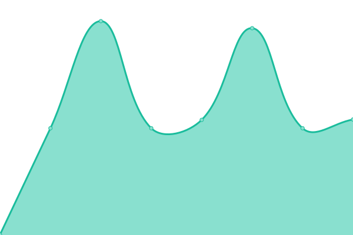 399ms
     
 | 

<a href="https://maxneuvians.github.io/history/immigration-and-refugee-board-of-canada">100.00%</a>
    

|  [Bibliothèque et Archives Canada / Library and Archives Canada](https://library-archives.canada.ca/) | Up / Opérationnel | [bibliotheque-et-archives-canada-library-and-archives-canada.yml](https://github.com/maxneuvians/status-statut/commits/HEAD/history/bibliotheque-et-archives-canada-library-and-archives-canada.yml) | 

 430ms
     
 | 

<a href="https://maxneuvians.github.io/history/bibliotheque-et-archives-canada-library-and-archives-canada">100.00%</a>
    

|  [Military Police Complaints Commission of Canada / Commission d’examen des plaintes concernant la police militaire du Canada](https://www.mpcc-cppm.gc.ca/) | Up / Opérationnel | [military-police-complaints-commission-of-canada-commission-d-examen-des-plaintes-concernant-la-police-militaire-du-canada.yml](https://github.com/maxneuvians/status-statut/commits/HEAD/history/military-police-complaints-commission-of-canada-commission-d-examen-des-plaintes-concernant-la-police-militaire-du-canada.yml) | 

 126ms
     
 | 

<a href="https://maxneuvians.github.io/history/military-police-complaints-commission-of-canada-commission-d-examen-des-plaintes-concernant-la-police-militaire-du-canada">100.00%</a>
    

|  [National Arts Centre / Canada is our stage](https://nac-cna.ca/) | Up / Opérationnel | [national-arts-centre-canada-is-our-stage.yml](https://github.com/maxneuvians/status-statut/commits/HEAD/history/national-arts-centre-canada-is-our-stage.yml) | 

 6803ms
     
 | 

<a href="https://maxneuvians.github.io/history/national-arts-centre-canada-is-our-stage">100.00%</a>
    

|  [Canadian Museum of Nature](https://nature.ca/) | Up / Opérationnel | [canadian-museum-of-nature.yml](https://github.com/maxneuvians/status-statut/commits/HEAD/history/canadian-museum-of-nature.yml) | 

 998ms
     
 | 

<a href="https://maxneuvians.github.io/history/canadian-museum-of-nature">100.00%</a>
    

|  [National Capital Commission -  National Capital Commission](https://ncc-ccn.gc.ca) | Up / Opérationnel | [national-capital-commission-national-capital-commission.yml](https://github.com/maxneuvians/status-statut/commits/HEAD/history/national-capital-commission-national-capital-commission.yml) | 

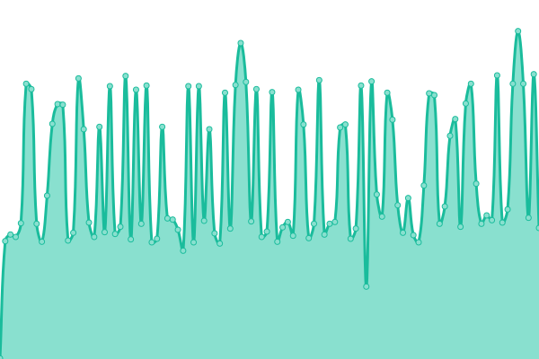 327ms
     
 | 

<a href="https://maxneuvians.github.io/history/national-capital-commission-national-capital-commission">100.00%</a>
    

|  [Northern Pipeline Agency / Administration du pipe-line du Nord](https://northern-pipeline.canada.ca) | Up / Opérationnel | [northern-pipeline-agency-administration-du-pipe-line-du-nord.yml](https://github.com/maxneuvians/status-statut/commits/HEAD/history/northern-pipeline-agency-administration-du-pipe-line-du-nord.yml) | 

 246ms
     
 | 

<a href="https://maxneuvians.github.io/history/northern-pipeline-agency-administration-du-pipe-line-du-nord">100.00%</a>
    

|  [Home - National Research Council Canada](https://nrc.canada.ca/en/) | Up / Opérationnel | [home-national-research-council-canada.yml](https://github.com/maxneuvians/status-statut/commits/HEAD/history/home-national-research-council-canada.yml) | 

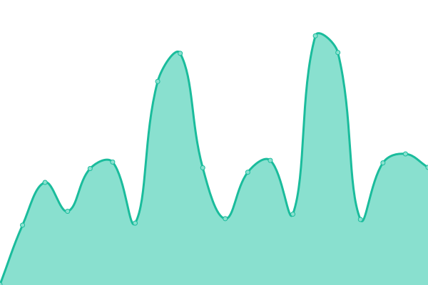 311ms
     
 | 

<a href="https://maxneuvians.github.io/history/home-national-research-council-canada">100.00%</a>
    

|  [Canadian Transportation Agency](https://otc-cta.gc.ca/) | Up / Opérationnel | [canadian-transportation-agency.yml](https://github.com/maxneuvians/status-statut/commits/HEAD/history/canadian-transportation-agency.yml) | 

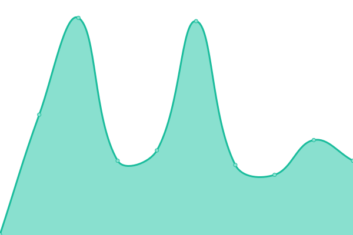 225ms
     
 | 

<a href="https://maxneuvians.github.io/history/canadian-transportation-agency">100.00%</a>
    

|  [Prime Minister of Canada / Premier ministre du Canada](https://pm.gc.ca) | Up / Opérationnel | [prime-minister-of-canada-premier-ministre-du-canada.yml](https://github.com/maxneuvians/status-statut/commits/HEAD/history/prime-minister-of-canada-premier-ministre-du-canada.yml) | 

 2312ms
     
 | 

<a href="https://maxneuvians.github.io/history/prime-minister-of-canada-premier-ministre-du-canada">100.00%</a>
    

|  [Travel.gc.ca - Home](https://travel.gc.ca/) | Up / Opérationnel | [travel-gc-ca-home.yml](https://github.com/maxneuvians/status-statut/commits/HEAD/history/travel-gc-ca-home.yml) | 

 381ms
     
 | 

<a href="https://maxneuvians.github.io/history/travel-gc-ca-home">100.00%</a>
    

|  [Weather Information - Environment Canada](https://weather.gc.ca/) | Up / Opérationnel | [weather-information-environment-canada.yml](https://github.com/maxneuvians/status-statut/commits/HEAD/history/weather-information-environment-canada.yml) | 

 717ms
     
 | 

<a href="https://maxneuvians.github.io/history/weather-information-environment-canada">100.00%</a>
    

|  [Agence de promotion économique du Canada atlantique / Atlantic Canada Opportunities Agency](https://www.acoa-apeca.gc.ca/) | Up / Opérationnel | [agence-de-promotion-economique-du-canada-atlantique-atlantic-canada-opportunities-agency.yml](https://github.com/maxneuvians/status-statut/commits/HEAD/history/agence-de-promotion-economique-du-canada-atlantique-atlantic-canada-opportunities-agency.yml) | 

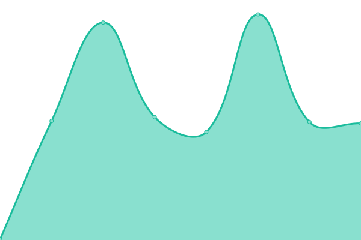 302ms
     
 | 

<a href="https://maxneuvians.github.io/history/agence-de-promotion-economique-du-canada-atlantique-atlantic-canada-opportunities-agency">100.00%</a>
    

|  [Atomic Energy of Canada Ltd (AECL) - Home](https://www.aecl.ca/) | Up / Opérationnel | [atomic-energy-of-canada-ltd-aecl-home.yml](https://github.com/maxneuvians/status-statut/commits/HEAD/history/atomic-energy-of-canada-ltd-aecl-home.yml) | 

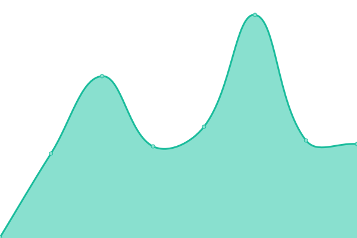 153ms
     
 | 

<a href="https://maxneuvians.github.io/history/atomic-energy-of-canada-ltd-aecl-home">100.00%</a>
    

|  [Agriculture and Agri-Food Canada / Agriculture et Agroalimentaire Canada](https://www.agr.gc.ca/) | Up / Opérationnel | [agriculture-and-agri-food-canada-agriculture-et-agroalimentaire-canada.yml](https://github.com/maxneuvians/status-statut/commits/HEAD/history/agriculture-and-agri-food-canada-agriculture-et-agroalimentaire-canada.yml) | 

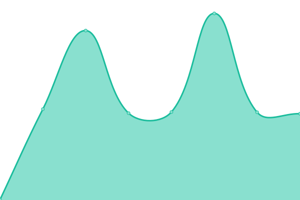 453ms
     
 | 

<a href="https://maxneuvians.github.io/history/agriculture-and-agri-food-canada-agriculture-et-agroalimentaire-canada">100.00%</a>
    

|  [Agence spatiale canadienne / Canadian Space Agency](https://www.asc-csa.gc.ca/) | Up / Opérationnel | [agence-spatiale-canadienne-canadian-space-agency.yml](https://github.com/maxneuvians/status-statut/commits/HEAD/history/agence-spatiale-canadienne-canadian-space-agency.yml) | 

 198ms
     
 | 

<a href="https://maxneuvians.github.io/history/agence-spatiale-canadienne-canadian-space-agency">100.00%</a>
    

|  [Bank of Canada](https://www.bankofcanada.ca/) | Up / Opérationnel | [bank-of-canada.yml](https://github.com/maxneuvians/status-statut/commits/HEAD/history/bank-of-canada.yml) | 

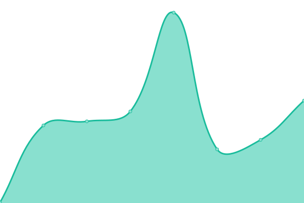 212ms
     
 | 

<a href="https://maxneuvians.github.io/history/bank-of-canada">100.00%</a>
    

|  [BDC - The Bank for Canadian Entrepreneurs / BDC.ca](https://www.bdc.ca/) | Up / Opérationnel | [bdc-the-bank-for-canadian-entrepreneurs-bdc-ca.yml](https://github.com/maxneuvians/status-statut/commits/HEAD/history/bdc-the-bank-for-canadian-entrepreneurs-bdc-ca.yml) | 

 875ms
     
 | 

<a href="https://maxneuvians.github.io/history/bdc-the-bank-for-canadian-entrepreneurs-bdc-ca">100.00%</a>
    

|  [Mailing and shipping for Personal and Business / Canada Post](https://www.canadapost-postescanada.ca/) | Up / Opérationnel | [mailing-and-shipping-for-personal-and-business-canada-post.yml](https://github.com/maxneuvians/status-statut/commits/HEAD/history/mailing-and-shipping-for-personal-and-business-canada-post.yml) | 

 1046ms
     
 | 

<a href="https://maxneuvians.github.io/history/mailing-and-shipping-for-personal-and-business-canada-post">100.00%</a>
    

|  [Canadian Northern Economic Development Agency / Agence canadienne de développement économique du Nord - Canada.ca](https://www.cannor.gc.ca/) | Up / Opérationnel | [canadian-northern-economic-development-agency-agence-canadienne-de-developpement-economique-du-nord-canada-ca.yml](https://github.com/maxneuvians/status-statut/commits/HEAD/history/canadian-northern-economic-development-agency-agence-canadienne-de-developpement-economique-du-nord-canada-ca.yml) | 

 342ms
     
 | 

<a href="https://maxneuvians.github.io/history/canadian-northern-economic-development-agency-agence-canadienne-de-developpement-economique-du-nord-canada-ca">100.00%</a>
    

|  [Welcome to Courts Administration Service / Bienvenue au Service administratif des tribunaux judiciaires](https://www.cas-satj.gc.ca/) | Up / Opérationnel | [welcome-to-courts-administration-service-bienvenue-au-service-administratif-des-tribunaux-judiciaires.yml](https://github.com/maxneuvians/status-statut/commits/HEAD/history/welcome-to-courts-administration-service-bienvenue-au-service-administratif-des-tribunaux-judiciaires.yml) | 

 282ms
     
 | 

<a href="https://maxneuvians.github.io/history/welcome-to-courts-administration-service-bienvenue-au-service-administratif-des-tribunaux-judiciaires">100.00%</a>
    

|  [Canadian Air Transport Security Authority / L'administration canadienne de la sûreté du transport aérien](https://www.catsa-acsta.gc.ca/) | Up / Opérationnel | [canadian-air-transport-security-authority-l-administration-canadienne-de-la-surete-du-transport-aerien.yml](https://github.com/maxneuvians/status-statut/commits/HEAD/history/canadian-air-transport-security-authority-l-administration-canadienne-de-la-surete-du-transport-aerien.yml) | 

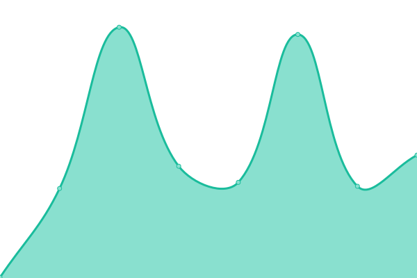 248ms
     
 | 

<a href="https://maxneuvians.github.io/history/canadian-air-transport-security-authority-l-administration-canadienne-de-la-surete-du-transport-aerien">100.00%</a>
    

|  [CBC.ca - watch, listen, and discover with Canada's Public Broadcaster](https://www.cbc.ca/) | Up / Opérationnel | [cbc-ca-watch-listen-and-discover-with-canada-s-public-broadcaster.yml](https://github.com/maxneuvians/status-statut/commits/HEAD/history/cbc-ca-watch-listen-and-discover-with-canada-s-public-broadcaster.yml) | 

 468ms
     
 | 

<a href="https://maxneuvians.github.io/history/cbc-ca-watch-listen-and-discover-with-canada-s-public-broadcaster">100.00%</a>
    

|  [Copyright Board of Canada](https://www.cb-cda.gc.ca/) | Up / Opérationnel | [copyright-board-of-canada.yml](https://github.com/maxneuvians/status-statut/commits/HEAD/history/copyright-board-of-canada.yml) | 

 394ms
     
 | 

<a href="https://maxneuvians.github.io/history/copyright-board-of-canada">99.49%</a>
    

|  [Canada Border Services Agency / Agence des services frontaliers du Canada](https://www.cbsa-asfc.gc.ca/) | Up / Opérationnel | [canada-border-services-agency-agence-des-services-frontaliers-du-canada.yml](https://github.com/maxneuvians/status-statut/commits/HEAD/history/canada-border-services-agency-agence-des-services-frontaliers-du-canada.yml) | 

 297ms
     
 | 

<a href="https://maxneuvians.github.io/history/canada-border-services-agency-agence-des-services-frontaliers-du-canada">100.00%</a>
    

|  [Bienvenue sur les plaines d'Abraham / Welcome to the Plains of Abraham](https://www.ccbn-nbc.gc.ca/) | Up / Opérationnel | [bienvenue-sur-les-plaines-d-abraham-welcome-to-the-plains-of-abraham.yml](https://github.com/maxneuvians/status-statut/commits/HEAD/history/bienvenue-sur-les-plaines-d-abraham-welcome-to-the-plains-of-abraham.yml) | 

 358ms
     
 | 

<a href="https://maxneuvians.github.io/history/bienvenue-sur-les-plaines-d-abraham-welcome-to-the-plains-of-abraham">100.00%</a>
    

|  [Canadian Commercial Corporation / CCC](https://www.ccc.ca/) | Up / Opérationnel | [canadian-commercial-corporation-ccc.yml](https://github.com/maxneuvians/status-statut/commits/HEAD/history/canadian-commercial-corporation-ccc.yml) | 

 307ms
     
 | 

<a href="https://maxneuvians.github.io/history/canadian-commercial-corporation-ccc">100.00%</a>
    

|  [Canadian Centre for Occupational Health and Safety](https://www.ccohs.ca/) | Up / Opérationnel | [canadian-centre-for-occupational-health-and-safety.yml](https://github.com/maxneuvians/status-statut/commits/HEAD/history/canadian-centre-for-occupational-health-and-safety.yml) | 

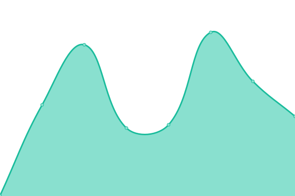 239ms
     
 | 

<a href="https://maxneuvians.github.io/history/canadian-centre-for-occupational-health-and-safety">100.00%</a>
    

|  [Canada Deposit Insurance Corporation / Société d'assurance-dépôts du Canada](https://www.cdic.ca/) | Up / Opérationnel | [canada-deposit-insurance-corporation-societe-d-assurance-depots-du-canada.yml](https://github.com/maxneuvians/status-statut/commits/HEAD/history/canada-deposit-insurance-corporation-societe-d-assurance-depots-du-canada.yml) | 

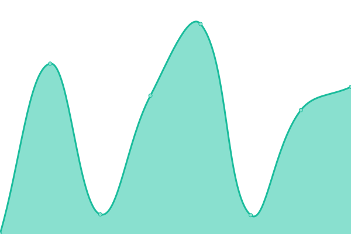 266ms
     
 | 

<a href="https://maxneuvians.github.io/history/canada-deposit-insurance-corporation-societe-d-assurance-depots-du-canada">100.00%</a>
    

|  [Canada Energy Regulator Site / Site de Régie de l’énergie du Canada](https://www.cer-rec.gc.ca/) | Up / Opérationnel | [canada-energy-regulator-site-site-de-regie-de-l-energie-du-canada.yml](https://github.com/maxneuvians/status-statut/commits/HEAD/history/canada-energy-regulator-site-site-de-regie-de-l-energie-du-canada.yml) | 

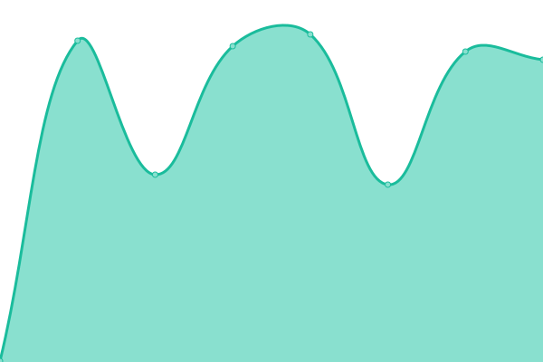 370ms
     
 | 

<a href="https://maxneuvians.github.io/history/canada-energy-regulator-site-site-de-regie-de-l-energie-du-canada">100.00%</a>
    

|  [Home / Canadian Human Rights Commission](https://www.chrc-ccdp.gc.ca/) | Up / Opérationnel | [home-canadian-human-rights-commission.yml](https://github.com/maxneuvians/status-statut/commits/HEAD/history/home-canadian-human-rights-commission.yml) | 

 336ms
     
 | 

<a href="https://maxneuvians.github.io/history/home-canadian-human-rights-commission">100.00%</a>
    

|  [Canada Mortgage and Housing Corporation](https://www.cmhc-schl.gc.ca/) | Up / Opérationnel | [canada-mortgage-and-housing-corporation.yml](https://github.com/maxneuvians/status-statut/commits/HEAD/history/canada-mortgage-and-housing-corporation.yml) | 

 951ms
     
 | 

<a href="https://maxneuvians.github.io/history/canada-mortgage-and-housing-corporation">100.00%</a>
    

|  [Canadian Nuclear Safety Commission - Commission canadienne de sûreté nucléaire](https://www.cnsc-ccsn.gc.ca/) | Up / Opérationnel | [canadian-nuclear-safety-commission-commission-canadienne-de-surete-nucleaire.yml](https://github.com/maxneuvians/status-statut/commits/HEAD/history/canadian-nuclear-safety-commission-commission-canadienne-de-surete-nucleaire.yml) | 

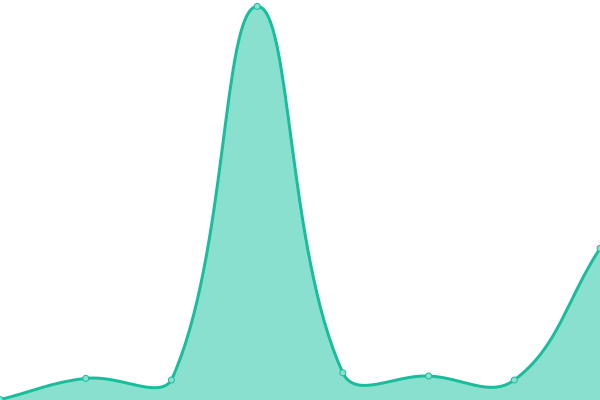 90ms
     
 | 

<a href="https://maxneuvians.github.io/history/canadian-nuclear-safety-commission-commission-canadienne-de-surete-nucleaire">100.00%</a>
    

|  [Welcome / Civilian Review and Complaints Commission for the RCMP](https://www.crcc-ccetp.gc.ca/) | Up / Opérationnel | [welcome-civilian-review-and-complaints-commission-for-the-rcmp.yml](https://github.com/maxneuvians/status-statut/commits/HEAD/history/welcome-civilian-review-and-complaints-commission-for-the-rcmp.yml) | 

 346ms
     
 | 

<a href="https://maxneuvians.github.io/history/welcome-civilian-review-and-complaints-commission-for-the-rcmp">100.00%</a>
    

|  [Correctional Service Canada / Service correctionnel Canada](https://www.csc-scc.gc.ca/) | Up / Opérationnel | [correctional-service-canada-service-correctionnel-canada.yml](https://github.com/maxneuvians/status-statut/commits/HEAD/history/correctional-service-canada-service-correctionnel-canada.yml) | 

 401ms
     
 | 

<a href="https://maxneuvians.github.io/history/correctional-service-canada-service-correctionnel-canada">100.00%</a>
    

|  [Communications Security Establishment](https://www.cse-cst.gc.ca/) | Up / Opérationnel | [communications-security-establishment.yml](https://github.com/maxneuvians/status-statut/commits/HEAD/history/communications-security-establishment.yml) | 

 227ms
     
 | 

<a href="https://maxneuvians.github.io/history/communications-security-establishment">100.00%</a>
    

|  [Canada School of Public Service / École de la fonction publique du Canada](https://www.csps-efpc.gc.ca/) | Up / Opérationnel | [canada-school-of-public-service-ecole-de-la-fonction-publique-du-canada.yml](https://github.com/maxneuvians/status-statut/commits/HEAD/history/canada-school-of-public-service-ecole-de-la-fonction-publique-du-canada.yml) | 

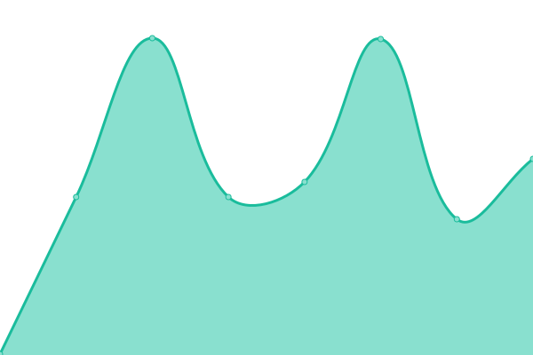 230ms
     
 | 

<a href="https://maxneuvians.github.io/history/canada-school-of-public-service-ecole-de-la-fonction-publique-du-canada">100.00%</a>
    

|  [DEC / Développement économique Canada pour les régions du Québec / Accueil](https://www.dec-ced.gc.ca/) | Down / En panne | [dec-developpement-economique-canada-pour-les-regions-du-quebec-accueil.yml](https://github.com/maxneuvians/status-statut/commits/HEAD/history/dec-developpement-economique-canada-pour-les-regions-du-quebec-accueil.yml) | 

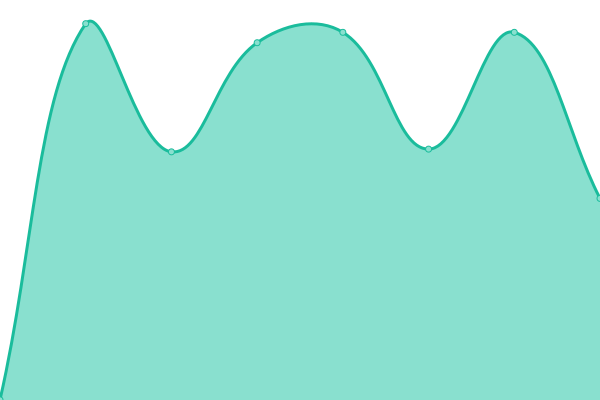 0ms
     
 | 

<a href="https://maxneuvians.github.io/history/dec-developpement-economique-canada-pour-les-regions-du-quebec-accueil">100.00%</a>
    

|  [Fisheries and Oceans Canada / Pêches et Océans Canada](https://www.dfo-mpo.gc.ca/) | Up / Opérationnel | [fisheries-and-oceans-canada-peches-et-oceans-canada.yml](https://github.com/maxneuvians/status-statut/commits/HEAD/history/fisheries-and-oceans-canada-peches-et-oceans-canada.yml) | 

 241ms
     
 | 

<a href="https://maxneuvians.github.io/history/fisheries-and-oceans-canada-peches-et-oceans-canada">100.00%</a>
    

|  [Export Development Canada (EDC)](https://www.edc.ca/) | Up / Opérationnel | [export-development-canada-edc.yml](https://github.com/maxneuvians/status-statut/commits/HEAD/history/export-development-canada-edc.yml) | 

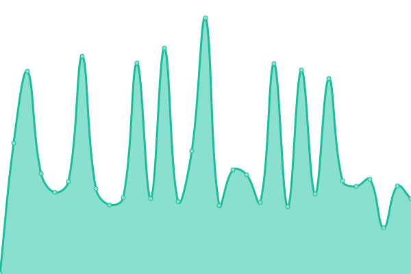 298ms
     
 | 

<a href="https://maxneuvians.github.io/history/export-development-canada-edc">100.00%</a>
    

|  [Farm Credit Canada / FCC](https://www.fcc-fac.ca/) | Up / Opérationnel | [farm-credit-canada-fcc.yml](https://github.com/maxneuvians/status-statut/commits/HEAD/history/farm-credit-canada-fcc.yml) | 

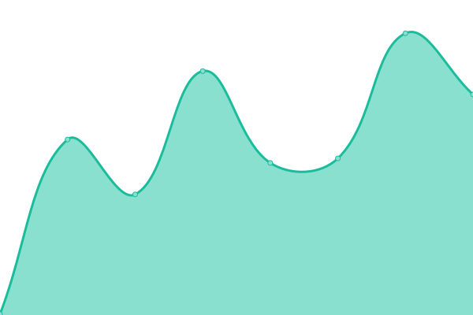 439ms
     
 | 

<a href="https://maxneuvians.github.io/history/farm-credit-canada-fcc">100.00%</a>
    

|  [Federal Economic Development Agency for Southern Ontario Main Site / Site principal Agence fédérale de développement économique pour le Sud de l'Ontario](https://www.feddevontario.gc.ca/) | Up / Opérationnel | [federal-economic-development-agency-for-southern-ontario-main-site-site-principal-agence-federale-de-developpement-economique-pour-le-sud-de-l-ontario.yml](https://github.com/maxneuvians/status-statut/commits/HEAD/history/federal-economic-development-agency-for-southern-ontario-main-site-site-principal-agence-federale-de-developpement-economique-pour-le-sud-de-l-ontario.yml) | 

 503ms
     
 | 

<a href="https://maxneuvians.github.io/history/federal-economic-development-agency-for-southern-ontario-main-site-site-principal-agence-federale-de-developpement-economique-pour-le-sud-de-l-ontario">100.00%</a>
    

|  [Financial Transactions and Reports Analysis Centre of Canada (FINTRAC) / Centre d'analyse des opérations et déclarations financières du Canada (CANAFE)](https://www.fintrac-canafe.gc.ca/) | Up / Opérationnel | [financial-transactions-and-reports-analysis-centre-of-canada-fintrac-centre-d-analyse-des-operations-et-declarations-financieres-du-canada-canafe.yml](https://github.com/maxneuvians/status-statut/commits/HEAD/history/financial-transactions-and-reports-analysis-centre-of-canada-fintrac-centre-d-analyse-des-operations-et-declarations-financieres-du-canada-canafe.yml) | 

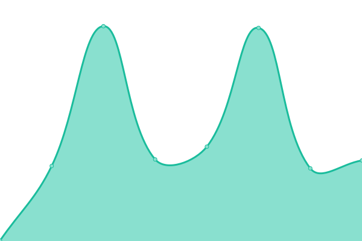 332ms
     
 | 

<a href="https://maxneuvians.github.io/history/financial-transactions-and-reports-analysis-centre-of-canada-fintrac-centre-d-analyse-des-operations-et-declarations-financieres-du-canada-canafe">100.00%</a>
    

|  [Office of the Commissioner for Federal Judicial Affairs Canada](https://www.fja-cmf.gc.ca/) | Up / Opérationnel | [office-of-the-commissioner-for-federal-judicial-affairs-canada.yml](https://github.com/maxneuvians/status-statut/commits/HEAD/history/office-of-the-commissioner-for-federal-judicial-affairs-canada.yml) | 

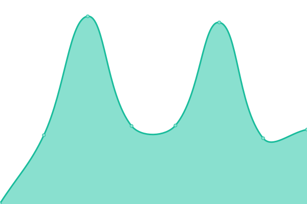 179ms
     
 | 

<a href="https://maxneuvians.github.io/history/office-of-the-commissioner-for-federal-judicial-affairs-canada">100.00%</a>
    

|  [National Gallery of Canada](https://www.gallery.ca/) | Up / Opérationnel | [national-gallery-of-canada.yml](https://github.com/maxneuvians/status-statut/commits/HEAD/history/national-gallery-of-canada.yml) | 

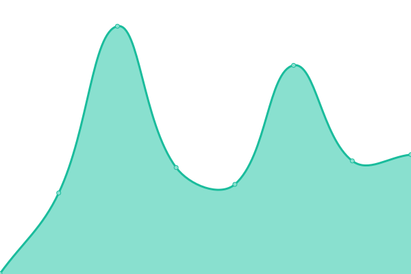 279ms
     
 | 

<a href="https://maxneuvians.github.io/history/national-gallery-of-canada">100.00%</a>
    

|  [Governor General of Canada / Gouverneure générale du Canada](https://www.gg.ca/) | Up / Opérationnel | [governor-general-of-canada-gouverneure-generale-du-canada.yml](https://github.com/maxneuvians/status-statut/commits/HEAD/history/governor-general-of-canada-gouverneure-generale-du-canada.yml) | 

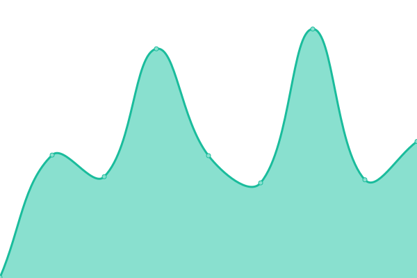 157ms
     
 | 

<a href="https://maxneuvians.github.io/history/governor-general-of-canada-gouverneure-generale-du-canada">100.00%</a>
    

|  [Canadian Grain Commission (CGC) / Commission canadienne des grains (CCG)](https://www.grainscanada.gc.ca/) | Up / Opérationnel | [canadian-grain-commission-cgc-commission-canadienne-des-grains-ccg.yml](https://github.com/maxneuvians/status-statut/commits/HEAD/history/canadian-grain-commission-cgc-commission-canadienne-des-grains-ccg.yml) | 

 322ms
     
 | 

<a href="https://maxneuvians.github.io/history/canadian-grain-commission-cgc-commission-canadienne-des-grains-ccg">100.00%</a>
    

|  [Home / Canadian Museum of History](https://www.historymuseum.ca/) | Up / Opérationnel | [home-canadian-museum-of-history.yml](https://github.com/maxneuvians/status-statut/commits/HEAD/history/home-canadian-museum-of-history.yml) | 

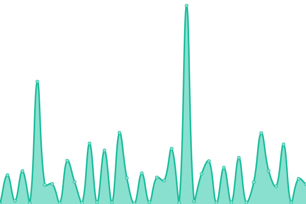 729ms
     
 | 

<a href="https://maxneuvians.github.io/history/home-canadian-museum-of-history">100.00%</a>
    

|  [Innovation, Science and Economic Development Canada Main Site /  Site principal d'Innovation, Sciences et Développement économique Canada](https://www.ic.gc.ca/) | Up / Opérationnel | [innovation-science-and-economic-development-canada-main-site-site-principal-d-innovation-sciences-et-developpement-economique-canada.yml](https://github.com/maxneuvians/status-statut/commits/HEAD/history/innovation-science-and-economic-development-canada-main-site-site-principal-d-innovation-sciences-et-developpement-economique-canada.yml) | 

 324ms
     
 | 

<a href="https://maxneuvians.github.io/history/innovation-science-and-economic-development-canada-main-site-site-principal-d-innovation-sciences-et-developpement-economique-canada">100.00%</a>
    

|  [IDRC - International Development Research Centre](https://www.idrc.ca/) | Up / Opérationnel | [idrc-international-development-research-centre.yml](https://github.com/maxneuvians/status-statut/commits/HEAD/history/idrc-international-development-research-centre.yml) | 

 572ms
     
 | 

<a href="https://maxneuvians.github.io/history/idrc-international-development-research-centre">100.00%</a>
    

|  [Infrastructure Canada / Infrastructure Canada](https://www.infrastructure.gc.ca/) | Up / Opérationnel | [infrastructure-canada-infrastructure-canada.yml](https://github.com/maxneuvians/status-statut/commits/HEAD/history/infrastructure-canada-infrastructure-canada.yml) | 

 204ms
     
 | 

<a href="https://maxneuvians.github.io/history/infrastructure-canada-infrastructure-canada">100.00%</a>
    

|  [Canadian Food Inspection Agency / Agence canadienne d'inspection des aliments](https://www.inspection.gc.ca/) | Up / Opérationnel | [canadian-food-inspection-agency-agence-canadienne-d-inspection-des-aliments.yml](https://github.com/maxneuvians/status-statut/commits/HEAD/history/canadian-food-inspection-agency-agence-canadienne-d-inspection-des-aliments.yml) | 

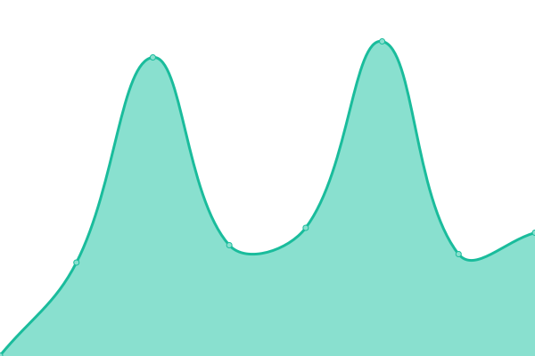 210ms
     
 | 

<a href="https://maxneuvians.github.io/history/canadian-food-inspection-agency-agence-canadienne-d-inspection-des-aliments">100.00%</a>
    

|  [Global Affairs Canada – Splash page / Affaires mondiales Canada – Page de garde](https://www.international.gc.ca/) | Up / Opérationnel | [global-affairs-canada-splash-page-affaires-mondiales-canada-page-de-garde.yml](https://github.com/maxneuvians/status-statut/commits/HEAD/history/global-affairs-canada-splash-page-affaires-mondiales-canada-page-de-garde.yml) | 

 236ms
     
 | 

<a href="https://maxneuvians.github.io/history/global-affairs-canada-splash-page-affaires-mondiales-canada-page-de-garde">100.00%</a>
    

|  [Department of Justice / Ministère de la Justice](https://www.justice.gc.ca/) | Up / Opérationnel | [department-of-justice-ministere-de-la-justice.yml](https://github.com/maxneuvians/status-statut/commits/HEAD/history/department-of-justice-ministere-de-la-justice.yml) | 

 228ms
     
 | 

<a href="https://maxneuvians.github.io/history/department-of-justice-ministere-de-la-justice">100.00%</a>
    

|  [Canadian Coins, Gold, Silver & More  / The Royal Canadian Mint](https://www.mint.ca/) | Up / Opérationnel | [canadian-coins-gold-silver-and-more-the-royal-canadian-mint.yml](https://github.com/maxneuvians/status-statut/commits/HEAD/history/canadian-coins-gold-silver-and-more-the-royal-canadian-mint.yml) | 

 720ms
     
 | 

<a href="https://maxneuvians.github.io/history/canadian-coins-gold-silver-and-more-the-royal-canadian-mint">100.00%</a>
    

|  [National Film Board of Canada](https://www.nfb.ca/) | Up / Opérationnel | [national-film-board-of-canada.yml](https://github.com/maxneuvians/status-statut/commits/HEAD/history/national-film-board-of-canada.yml) | 

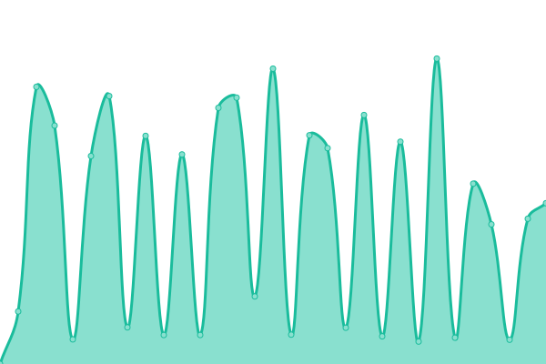 520ms
     
 | 

<a href="https://maxneuvians.github.io/history/national-film-board-of-canada">100.00%</a>
    

|  [Natural Resources Canada / Ressources naturelles Canada](https://www.nrcan.gc.ca/) | Up / Opérationnel | [natural-resources-canada-ressources-naturelles-canada.yml](https://github.com/maxneuvians/status-statut/commits/HEAD/history/natural-resources-canada-ressources-naturelles-canada.yml) | 

 231ms
     
 | 

<a href="https://maxneuvians.github.io/history/natural-resources-canada-ressources-naturelles-canada">100.00%</a>
    

|  [Natural Sciences and Engineering Research Council of Canada  / Conseil de recherches en sciences naturelles et en génie du Canada](https://www.nserc-crsng.gc.ca/) | Up / Opérationnel | [natural-sciences-and-engineering-research-council-of-canada-conseil-de-recherches-en-sciences-naturelles-et-en-genie-du-canada.yml](https://github.com/maxneuvians/status-statut/commits/HEAD/history/natural-sciences-and-engineering-research-council-of-canada-conseil-de-recherches-en-sciences-naturelles-et-en-genie-du-canada.yml) | 

 207ms
     
 | 

<a href="https://maxneuvians.github.io/history/natural-sciences-and-engineering-research-council-of-canada-conseil-de-recherches-en-sciences-naturelles-et-en-genie-du-canada">100.00%</a>
    

|  [National Security and Intelligence Committee of Parliamentarians (NSICOP)](https://www.nsicop-cpsnr.ca/) | Up / Opérationnel | [national-security-and-intelligence-committee-of-parliamentarians-nsicop.yml](https://github.com/maxneuvians/status-statut/commits/HEAD/history/national-security-and-intelligence-committee-of-parliamentarians-nsicop.yml) | 

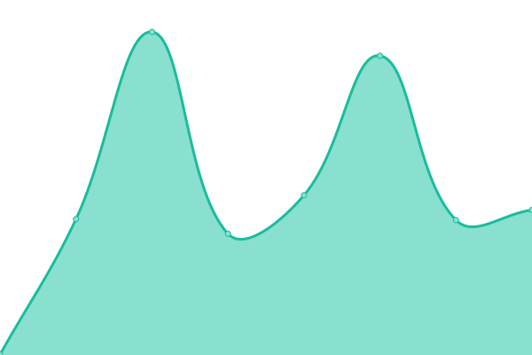 2054ms
     
 | 

<a href="https://maxneuvians.github.io/history/national-security-and-intelligence-committee-of-parliamentarians-nsicop">100.00%</a>
    

|  [Office of the Correctional Investigator / Bureau de l'enquêteur correctionnel](https://www.oci-bec.gc.ca/) | Up / Opérationnel | [office-of-the-correctional-investigator-bureau-de-l-enqueteur-correctionnel.yml](https://github.com/maxneuvians/status-statut/commits/HEAD/history/office-of-the-correctional-investigator-bureau-de-l-enqueteur-correctionnel.yml) | 

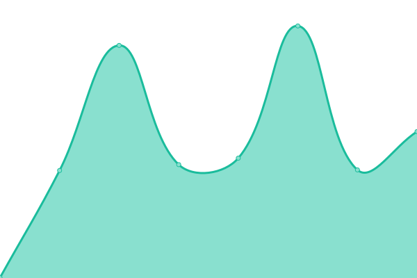 418ms
     
 | 

<a href="https://maxneuvians.github.io/history/office-of-the-correctional-investigator-bureau-de-l-enqueteur-correctionnel">100.00%</a>
    

|  [Office of the Superintendent of Financial Institutions](https://www.osfi-bsif.gc.ca/) | Up / Opérationnel | [office-of-the-superintendent-of-financial-institutions.yml](https://github.com/maxneuvians/status-statut/commits/HEAD/history/office-of-the-superintendent-of-financial-institutions.yml) | 

 280ms
     
 | 

<a href="https://maxneuvians.github.io/history/office-of-the-superintendent-of-financial-institutions">100.00%</a>
    

|  [Parks Canada](https://www.pc.gc.ca/) | Up / Opérationnel | [parks-canada.yml](https://github.com/maxneuvians/status-statut/commits/HEAD/history/parks-canada.yml) | 

 1159ms
     
 | 

<a href="https://maxneuvians.github.io/history/parks-canada">100.00%</a>
    

|  [Public Prosecution Service of Canada / Service des poursuites pénales du Canada](https://www.ppsc-sppc.gc.ca/) | Up / Opérationnel | [public-prosecution-service-of-canada-service-des-poursuites-penales-du-canada.yml](https://github.com/maxneuvians/status-statut/commits/HEAD/history/public-prosecution-service-of-canada-service-des-poursuites-penales-du-canada.yml) | 

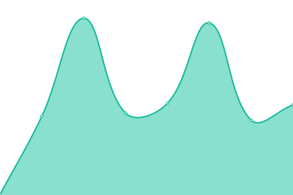 232ms
     
 | 

<a href="https://maxneuvians.github.io/history/public-prosecution-service-of-canada-service-des-poursuites-penales-du-canada">100.00%</a>
    

|  [Public Safety Canada / Sécurité publique Canada](https://www.publicsafety.gc.ca/) | Up / Opérationnel | [public-safety-canada-securite-publique-canada.yml](https://github.com/maxneuvians/status-statut/commits/HEAD/history/public-safety-canada-securite-publique-canada.yml) | 

 240ms
     
 | 

<a href="https://maxneuvians.github.io/history/public-safety-canada-securite-publique-canada">100.00%</a>
    

|  [Relations Couronne-Autochtones et Affaires du Nord Canada / Crown-Indigenous Relations and Northern Affairs Canada - Canada.ca](https://www.rcaanc-cirnac.gc.ca/) | Up / Opérationnel | [relations-couronne-autochtones-et-affaires-du-nord-canada-crown-indigenous-relations-and-northern-affairs-canada-canada-ca.yml](https://github.com/maxneuvians/status-statut/commits/HEAD/history/relations-couronne-autochtones-et-affaires-du-nord-canada-crown-indigenous-relations-and-northern-affairs-canada-canada-ca.yml) | 

 358ms
     
 | 

<a href="https://maxneuvians.github.io/history/relations-couronne-autochtones-et-affaires-du-nord-canada-crown-indigenous-relations-and-northern-affairs-canada-canada-ca">100.00%</a>
    

|  [National Home Page / Royal Canadian Mounted Police](https://www.rcmp-grc.gc.ca/) | Up / Opérationnel | [national-home-page-royal-canadian-mounted-police.yml](https://github.com/maxneuvians/status-statut/commits/HEAD/history/national-home-page-royal-canadian-mounted-police.yml) | 

 274ms
     
 | 

<a href="https://maxneuvians.github.io/history/national-home-page-royal-canadian-mounted-police">100.00%</a>
    

|  [Services aux Autochtones Canada / Indigenous Services Canada - Canada.ca](https://www.sac-isc.gc.ca/) | Up / Opérationnel | [services-aux-autochtones-canada-indigenous-services-canada-canada-ca.yml](https://github.com/maxneuvians/status-statut/commits/HEAD/history/services-aux-autochtones-canada-indigenous-services-canada-canada-ca.yml) | 

 375ms
     
 | 

<a href="https://maxneuvians.github.io/history/services-aux-autochtones-canada-indigenous-services-canada-canada-ca">100.00%</a>
    

|  [Supreme Court of Canada / Cour suprême du Canada](https://www.scc-csc.ca/) | Up / Opérationnel | [supreme-court-of-canada-cour-supreme-du-canada.yml](https://github.com/maxneuvians/status-statut/commits/HEAD/history/supreme-court-of-canada-cour-supreme-du-canada.yml) | 

 596ms
     
 | 

<a href="https://maxneuvians.github.io/history/supreme-court-of-canada-cour-supreme-du-canada">92.88%</a>
    

|  [Canadian Intergovernmental Conference Secretariat / SecrÕtariat des confÕrences intergouvernementales canadiennes](https://www.scics.ca/) | Up / Opérationnel | [canadian-intergovernmental-conference-secretariat-secr-otariat-des-conf-orences-intergouvernementales-canadiennes.yml](https://github.com/maxneuvians/status-statut/commits/HEAD/history/canadian-intergovernmental-conference-secretariat-secr-otariat-des-conf-orences-intergouvernementales-canadiennes.yml) | 

 188ms
     
 | 

<a href="https://maxneuvians.github.io/history/canadian-intergovernmental-conference-secretariat-secr-otariat-des-conf-orences-intergouvernementales-canadiennes">100.00%</a>
    

|  [Social Sciences and Humanities Research Council / Conseil de recherches en sciences humaines](https://www.sshrc-crsh.gc.ca/) | Up / Opérationnel | [social-sciences-and-humanities-research-council-conseil-de-recherches-en-sciences-humaines.yml](https://github.com/maxneuvians/status-statut/commits/HEAD/history/social-sciences-and-humanities-research-council-conseil-de-recherches-en-sciences-humaines.yml) | 

 210ms
     
 | 

<a href="https://maxneuvians.github.io/history/social-sciences-and-humanities-research-council-conseil-de-recherches-en-sciences-humaines">100.00%</a>
    

|  [Statistics Canada - Canada's national statistical agency / Statistique Canada - Organisme statistique national du Canada](https://www.statcan.gc.ca/) | Up / Opérationnel | [statistics-canada-canada-s-national-statistical-agency-statistique-canada-organisme-statistique-national-du-canada.yml](https://github.com/maxneuvians/status-statut/commits/HEAD/history/statistics-canada-canada-s-national-statistical-agency-statistique-canada-organisme-statistique-national-du-canada.yml) | 

 337ms
     
 | 

<a href="https://maxneuvians.github.io/history/statistics-canada-canada-s-national-statistical-agency-statistique-canada-organisme-statistique-national-du-canada">100.00%</a>
    

|  [Transport Canada / Transports Canada](https://www.tc.gc.ca/) | Up / Opérationnel | [transport-canada-transports-canada.yml](https://github.com/maxneuvians/status-statut/commits/HEAD/history/transport-canada-transports-canada.yml) | 

 272ms
     
 | 

<a href="https://maxneuvians.github.io/history/transport-canada-transports-canada">99.84%</a>
    

|  [Transportation Safety Board of Canada / Bureau de la sécurité des transports du Canada](https://www.tsb.gc.ca/) | Down / En panne | [transportation-safety-board-of-canada-bureau-de-la-securite-des-transports-du-canada.yml](https://github.com/maxneuvians/status-statut/commits/HEAD/history/transportation-safety-board-of-canada-bureau-de-la-securite-des-transports-du-canada.yml) | 

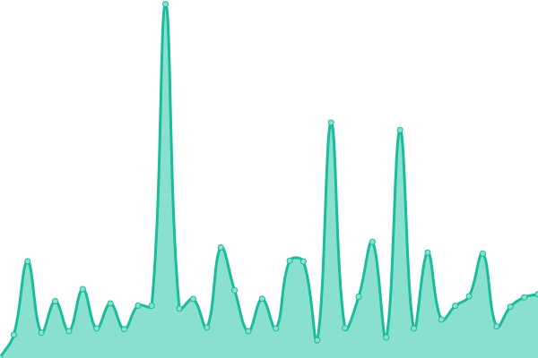 312ms
     
 | 

<a href="https://maxneuvians.github.io/history/transportation-safety-board-of-canada-bureau-de-la-securite-des-transports-du-canada">100.00%</a>
    

|  [Welcome to the Treasury Board of Canada Secretariat / Bienvenue au Secrétariat du Conseil du Trésor du Canada](https://www.tbs-sct.gc.ca/) | Up / Opérationnel | [welcome-to-the-treasury-board-of-canada-secretariat-bienvenue-au-secretariat-du-conseil-du-tresor-du-canada.yml](https://github.com/maxneuvians/status-statut/commits/HEAD/history/welcome-to-the-treasury-board-of-canada-secretariat-bienvenue-au-secretariat-du-conseil-du-tresor-du-canada.yml) | 

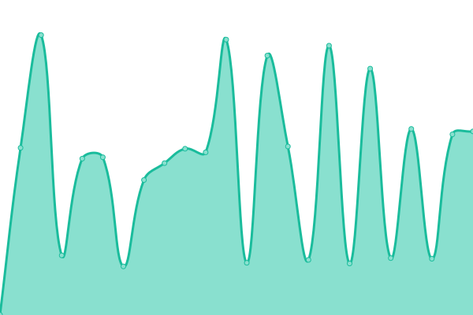 781ms
     
 | 

<a href="https://maxneuvians.github.io/history/welcome-to-the-treasury-board-of-canada-secretariat-bienvenue-au-secretariat-du-conseil-du-tresor-du-canada">100.00%</a>
    

|  [Veterans Affairs Canada / Anciens Combattants Canada](https://www.veterans.gc.ca/) | Up / Opérationnel | [veterans-affairs-canada-anciens-combattants-canada.yml](https://github.com/maxneuvians/status-statut/commits/HEAD/history/veterans-affairs-canada-anciens-combattants-canada.yml) | 

 419ms
     
 | 

<a href="https://maxneuvians.github.io/history/veterans-affairs-canada-anciens-combattants-canada">99.85%</a>
    

|  [Veterans Review and Appeal Board / Tribunal des anciens combattants (révision et appel)](https://www.vrab-tacra.gc.ca/) | Up / Opérationnel | [veterans-review-and-appeal-board-tribunal-des-anciens-combattants-revision-et-appel.yml](https://github.com/maxneuvians/status-statut/commits/HEAD/history/veterans-review-and-appeal-board-tribunal-des-anciens-combattants-revision-et-appel.yml) | 

 1010ms
     
 | 

<a href="https://maxneuvians.github.io/history/veterans-review-and-appeal-board-tribunal-des-anciens-combattants-revision-et-appel">100.00%</a>
    

|  [Western Economic Diversification Canada / Diversification de l'économie de l'Ouest Canada](https://www.wd-deo.gc.ca/) | Up / Opérationnel | [western-economic-diversification-canada-diversification-de-l-economie-de-l-ouest-canada.yml](https://github.com/maxneuvians/status-statut/commits/HEAD/history/western-economic-diversification-canada-diversification-de-l-economie-de-l-ouest-canada.yml) | 

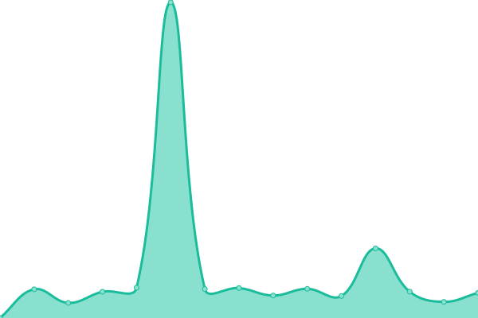 384ms
     
 | 

<a href="https://maxneuvians.github.io/history/western-economic-diversification-canada-diversification-de-l-economie-de-l-ouest-canada">100.00%</a>
    

|  [Canada Border Services Agency / Agence des services frontaliers du Canada](http://www.cbsa-asfc.gc.ca/) | Up / Opérationnel | [canada-border-services-agency-agence-des-services-frontaliers-du-canada.yml](https://github.com/maxneuvians/status-statut/commits/HEAD/history/canada-border-services-agency-agence-des-services-frontaliers-du-canada.yml) | 

 297ms
     
 | 

<a href="https://maxneuvians.github.io/history/canada-border-services-agency-agence-des-services-frontaliers-du-canada">100.00%</a>
    

|  [Global Affairs Canada / Affaires mondiales Canada](http://www.international.gc.ca/) | Up / Opérationnel | [global-affairs-canada-affaires-mondiales-canada.yml](https://github.com/maxneuvians/status-statut/commits/HEAD/history/global-affairs-canada-affaires-mondiales-canada.yml) | 

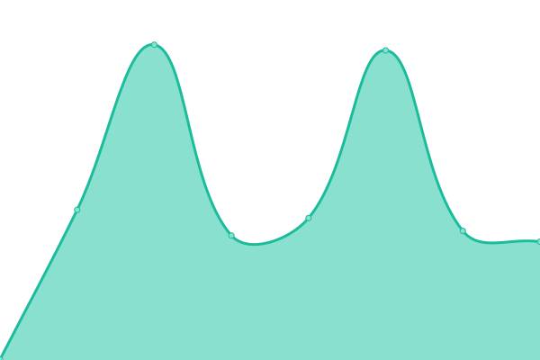 291ms
     
 | 

<a href="https://maxneuvians.github.io/history/global-affairs-canada-affaires-mondiales-canada">100.00%</a>
    

<!--end: status pages-->

[**Visit our status website →**](https://neuvians.io)

## 📄 License

- Powered by: [Upptime](https://github.com/upptime/upptime)
- Code: [MIT](./LICENSE) © [Anand Chowdhary](https://anandchowdhary.com), supported by [Pabio](https://pabio.com)
- Data in the `./history` directory: [Open Database License](https://opendatacommons.org/licenses/odbl/1-0/)
